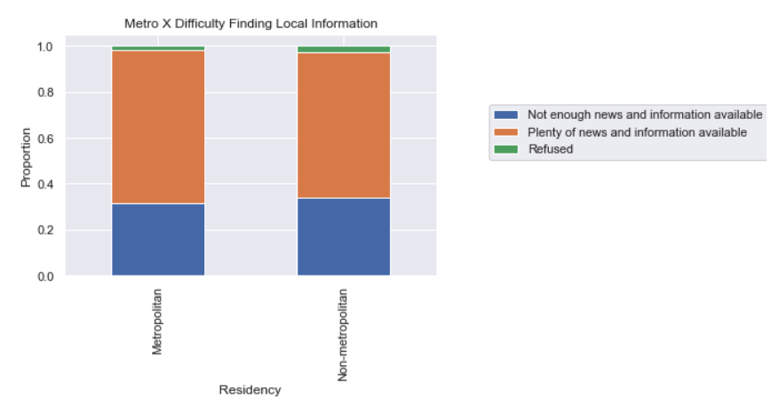

# Media Literacy Insights from PEW Research Center's American Trends Panel: Wave 68 

## Background
For the past five years, I have worked as a school librarian teaching information literacy skills to students in grades PK-12. Often, my instruction focuses on media literacy. Because of my this, I have been keenly aware of the challenges involved in discerning factual information from information that is sensational, misleading, faulty, or propagandistic and I often find myself wondering what the factors are that make us more or less prone to accepting faulty information. What are the factors that play into making it more difficult ot find good information? Durint the pandemic, the importance of being able to navigate all kinds of media in order to find trustworthy information, is underscored. 

What factors are the most significant indicators that a population will have a difficult time finding their way through today's information landscape in search of vital information? Addtionally, I wonder, if there are demographic factors playing an important role in fact fining and media use, is there anything we can do to improve the outcomes for those demographics?

 
In oreder to address my questions, I used survey information made available by the PEW research center's American Trends Panel: Wave 68 to seek insights on demographic factors as they relate to media literacy issues. I was excited to see that this dataset contains survey questions relating to media consumption as it related to coverage of the COVID-19 pandemic. 

## Data

The dataset consists of 146 columns and 9654 rows. Each row represents a survey respondent. For the purposes of my analysis, I pulled out 15 rows to examine more closely. Twelve of those rows are categorized answers to survey questions relating to media and the pandemic. The other three rows (Education Level Attained, Party Affiliation, Metropolitan or Non-Metropolitan Residency) list demographic qualities of respondents . I chose the quesitons that were most specifically related to the consumption of news and other online media.

Other quesitons in this survey addressed racial tensions, pandemic-related issues, and the election cycle. 

More information about the columns I chose to investigate can be found here. [Column Data](https://github.com/Adorism/pew_w68_media_literacy_insights/blob/main/data/column_descriptions.md "Column Data")

## Process and Methodology
The survey results are encoded and answers are categorical, rather than truly numeric. Therefore, I used [contingency tables](https://en.wikipedia.org/wiki/Contingency_table) and [Pearson's Chi-Squared Test](https://en.wikipedia.org/wiki/Pearson%27s_chi-squared_test) to examine relationships between pairs of variables. 

In most cases, whether the contingency tables were normalized or not, I saw a trend in the demographic columns. 
One of my expectations did not hold up to scrutiny. I had expected to see more evidence of a correlationi between non-metropolitan residency and difficulty navigating the media. Instead, I saw very uniform distribution in answering patterns for metropolitan and non-metropolitan residents. In fact, there is one question where that demographic facet was most influential, regarding the difficulty of finding local news relating to the pandemic. The chi-number is small. The graph indicates hardly any variation at all. Even at it's most significant, metropolitan and non-metropolitan residents show hardly any difference in the ways they answered these questions. 

  
As I guessed, there were questions for which people belonging to different political parties had a noticeable pattern of different answers. However, the degree of signifigance for this demographic facet was not as strong as I had guessed it would be. 
The most stark difference when taking this demographic feature into account can be seen in the answers to the following question: How often, if ever, do you think the news media gets the facts right about the coronavirus pandemic?

 

## Key Insights

## Future Considerations
 
From a technical perspective: 

I know that there is a sizeable industry focused solely on administering and interpreting surveys. 

There are incredibly useful data vizualization tools on the market that can enhance the readability of the charts I created, making the message more clear. One of those, which I tested out, is called "Flourish" (hyperlink it) and I was curious to try it out because I saw some interesting vizualizations on the web that had been created using this tool. I was looking, specifically, for a tool that could approximate the approach of many vizualizations that PEW Research creates using their own datasets, where a horizontal stacked barchart has a mid-point signifying a shift from positive to negative values. And example of such a chrt can be found here. https://www.pewresearch.org/politics/?attachment_id=20077157 When I used normalized values from contingency tables as the input for a graph on Flourish, I was able to create a rough, albeit imperfect approximation of the way that data is displayed in the PEW chart I linked. I want to know more about chart building tools in Python to see if similar graphing capabilities exist using Python. 

From the perspective of subject-area interest:
I want to know more about practical ways to make news media more useful to people in politically charged times and also, to investigate teachable strategies for news and online media consumers to improve meta-cognition in determining the trustworthines of an information source. 

## Code

## Notes

## References
“An Introduction to the Chi-Square Test & When to Use It | SurveyGizmo.” 2018. Alchemer. https://www.surveygizmo.com/resources/blog/introduction-to-chi-square-test-and-when-to-use-it/ (February 23, 2021). 
“Catplot Python Seaborn: One Function to Rule All Plots With Categorical Variables.” 2019. Python and R Tips. https://cmdlinetips.com/2019/03/catplot-in-seaborn-python/ (February 23, 2021). 
Chambliss, Charlene. 2019. “Cleaning, Analyzing, and Visualizing Survey Data in Python.” Medium. https://towardsdatascience.com/cleaning-analyzing-and-visualizing-survey-data-in-python-42747a13c713 (February 23, 2021). 
Custer, Charlie. 2019. “How to Analyze Survey Data with Python for Beginners.” Dataquest. https://www.dataquest.io/blog/how-to-analyze-survey-data-python-beginner/ (February 22, 2021). 
“Kendall Tau Metric - Encyclopedia of Mathematics.” https://encyclopediaofmath.org/index.php?title=Kendall_tau_metric (February 22, 2021). 
Mitchell, Amy, Mark Jurkowitz, J. Baxter Oliphant, and Elisa Shearer. 2021. “Methodology.” Pew Research Center’s Journalism Project. https://www.journalism.org/2021/02/22/how-americans-navigated-the-news-in-2020-methodology/ (February 22, 2021). 
NW, 1615 L. St, Suite 800Washington, and DC 20036USA202-419-4300 | Main202-857-8562 | Fax202-419-4372 | Media Inquiries. “American News Pathways.” Pew Research Center. https://www.pewresearch.org/topics/american-news-pathways/ (February 22, 2021). 
“Ordinal Association.” Statistics Solutions. https://www.statisticssolutions.com/ordinal-association/ (February 22, 2021). 
“Plotting with Categorical Data — Seaborn 0.11.1 Documentation.” http://seaborn.pydata.org/tutorial/categorical.html?highlight=bar%20plot (February 23, 2021). 
“Scipy.Stats.Chisquare — SciPy v1.6.1 Reference Guide.” https://docs.scipy.org/doc/scipy/reference/generated/scipy.stats.chisquare.html (February 23, 2021). 
“Spearman’s Rank-Order Correlation - A Guide to When to Use It, What It Does and What the Assumptions Are.” https://statistics.laerd.com/statistical-guides/spearmans-rank-order-correlation-statistical-guide.php (February 22, 2021). 
“(Tutorial) Handling Categorical Data in Python.” 2020. DataCamp Community. https://www.datacamp.com/community/tutorials/categorical-data (February 22, 2021). 
“Understanding Chi Square | Practical Surveys.” https://practicalsurveys.com/reporting/chisquare.php (February 23, 2021). 

Image source for Intro : Photo by <a href="https://unsplash.com/@thenewmalcolm?utm_source=unsplash&amp;utm_medium=referral&amp;utm_content=creditCopyText">Obi Onyeador</a> on <a href="https://unsplash.com/s/photos/news?utm_source=unsplash&amp;utm_medium=referral&amp;utm_content=creditCopyText">Unsplash</a>
