# Media Literacy Insights from PEW Research Center's American Trends Panel: Wave 68 

## Background
For the past five years, I have worked as a school librarian teaching information literacy skills to students in grades PK-12. Often, my instruction focuses on media literacy. Because of my this, I have been keenly aware of the challenges involved in discerning factual information from information that is sensational, misleading, faulty, or propagandistic and I often find myself wondering what the factors are that make us more or less prone to accepting faulty information. What are the factors that play into making it more difficult ot find good information? During the pandemic, the importance of being able to navigate all kinds of media in order to find trustworthy information is underscored. 

What factors are the most significant indicators that a population will have a difficult time finding their way through today's information landscape in search of vital information? Additionally, I wonder if there are demographic factors playing an important role in fact finding and media use, is there anything we can do to improve the outcomes for those demographics?

 
In order to address my questions, I used survey information made available by the PEW research center's American Trends Panel: Wave 68 to seek insights on demographic factors as they relate to media literacy issues. I was excited to see that this dataset contains survey questions relating to media consumption as it relates to coverage of the COVID-19 pandemic. 

## Data

The dataset consists of 146 columns and 9654 rows. Each row represents a survey respondent. For the purposes of my analysis, I pulled out 15 columns to examine more closely. Twelve of those rows are categorized answers to survey questions relating to media and the pandemic. The other three columns (Education Level Attained, Party Affiliation, Metropolitan or Non-Metropolitan Residency) list demographic qualities of respondents . I chose the questions that were most specifically related to the consumption of news and other online media.

Other questions in this survey addressed racial tensions, pandemic-related issues, and the election cycle. 

More information about the columns I chose to investigate can be found here. [Column Data](https://github.com/Adorism/pew_w68_media_literacy_insights/blob/main/data/column_descriptions.md "Column Data")

## Process and Methodology
The survey results are encoded and answers are categorical, rather than truly numeric. Therefore, I used [contingency tables](https://en.wikipedia.org/wiki/Contingency_table) and [Pearson's Chi-Squared Test](https://en.wikipedia.org/wiki/Pearson%27s_chi-squared_test) to examine relationships between pairs of variables. 

In most cases, whether the contingency tables were normalized or not, I saw a trend in the demographic columns. 
One of my expectations did not hold up to scrutiny. I had expected to see more evidence of a correlation between non-metropolitan residency and difficulty navigating the media. Instead, I saw a very uniform distribution in answering patterns for metropolitan and non-metropolitan residents. In fact, there is one question where that demographic facet was most influential, regarding the difficulty of finding local news relating to the pandemic. The chi-number is small. The graph indicates hardly any variation at all. Even at its most significant, metropolitan and non-metropolitan residents show hardly any difference in the ways they answered these questions. 
  

  
As I guessed, there were questions for which people belonging to different political parties had a noticeable pattern of different answers. However, the degree of significance for this demographic facet was not as strong as I had hypothesized it would be. 
The most stark difference when taking this demographic feature into account can be seen in the answers to the following question: How often, if ever, do you think the news media gets the facts right about the coronavirus pandemic? 
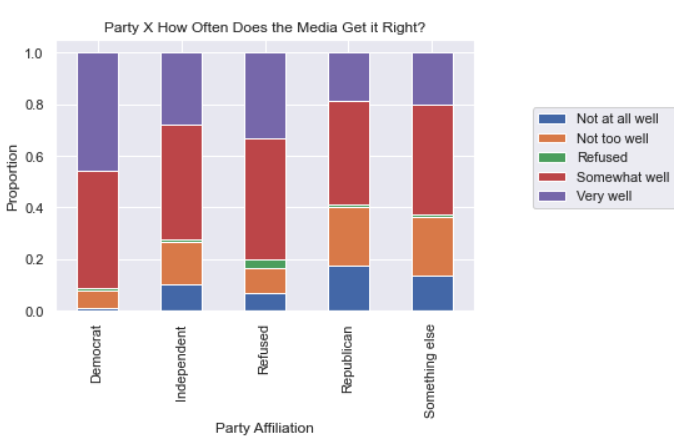
 
 

## Key Insights
You may have guessed it by now: the most significant demographic facet of this dataset in matters related to navigating media concerning the pandemic is educational level!
As years of education went up, the likelihood that a person might believe the conspiracy theory portrayed in "Plandemic" went down. 
 
 
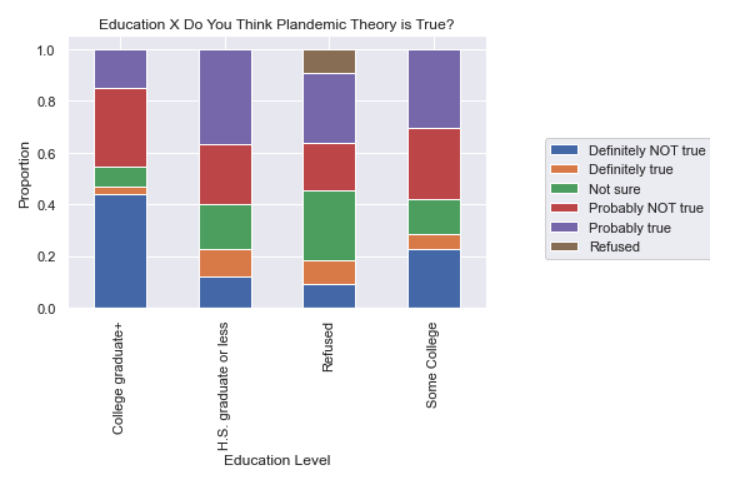  

A respondent's education level was also likely to influence answers to other important questions.   
1: How closely have you been following news about the outbreak of the coronavirus strain known as COVID-19?
 
 
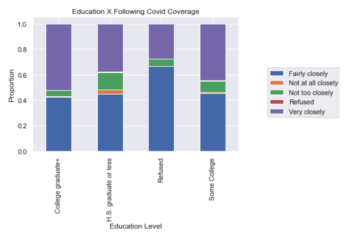  
2: Compared to the FIRST COUPLE OF WEEKS of the outbreak, are you spending more or less time getting news about the outbreak?
 
 
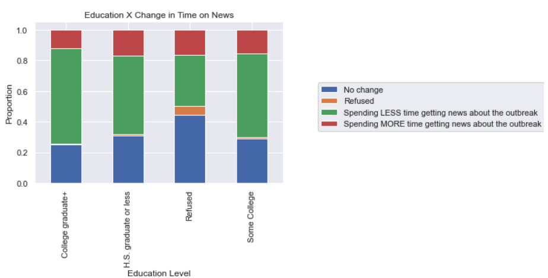  
3: Compared to the FIRST COUPLE OF WEEKS of the outbreak, are you finding it harder or easier to understand what is happening with the outbreak?
 
 
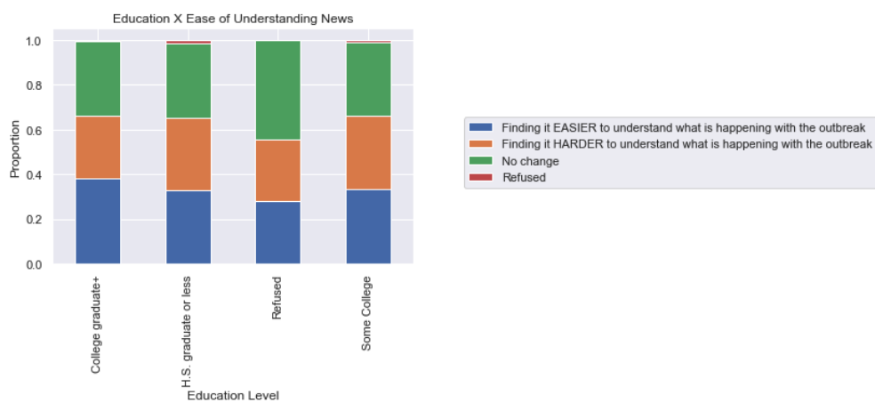  
4: Compared to the FIRST COUPLE OF WEEKS of the outbreak, are you seeing more or less partisan views in the news?
 
 
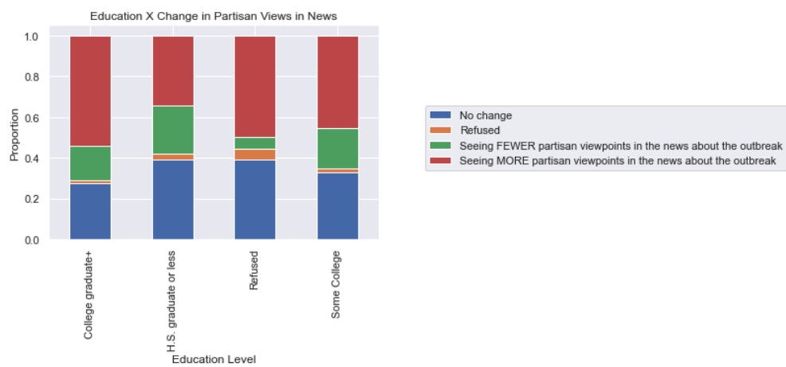  
5: Compared to the FIRST COUPLE OF WEEKS of the outbreak, are you finding it harder or easier to identify what is true and false in the news?
 
 
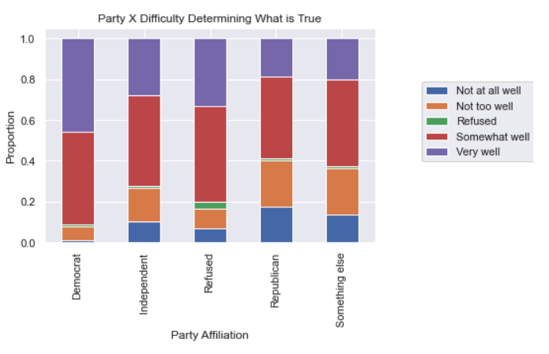  
6: How much, if anything, have you heard about the theory that powerful people intentionally planned the coronavirus outbreak?
 
 
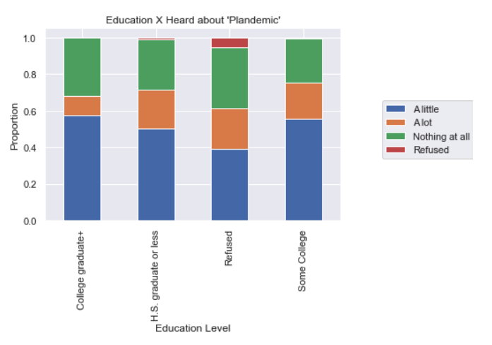  
7: As you may know, an online video called "Plandemic" has received attention for making claims that the coronavirus outbreak was planned by powerful people. Have you personally watched all or part of this online video called "Plandemic"?
 
 
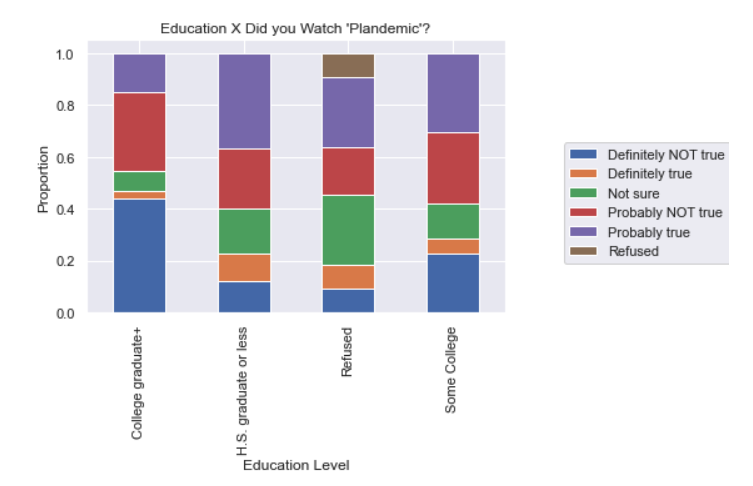  
All said, education level was most frequently the most significant out of the three demographic facets I investigated. 
 
 
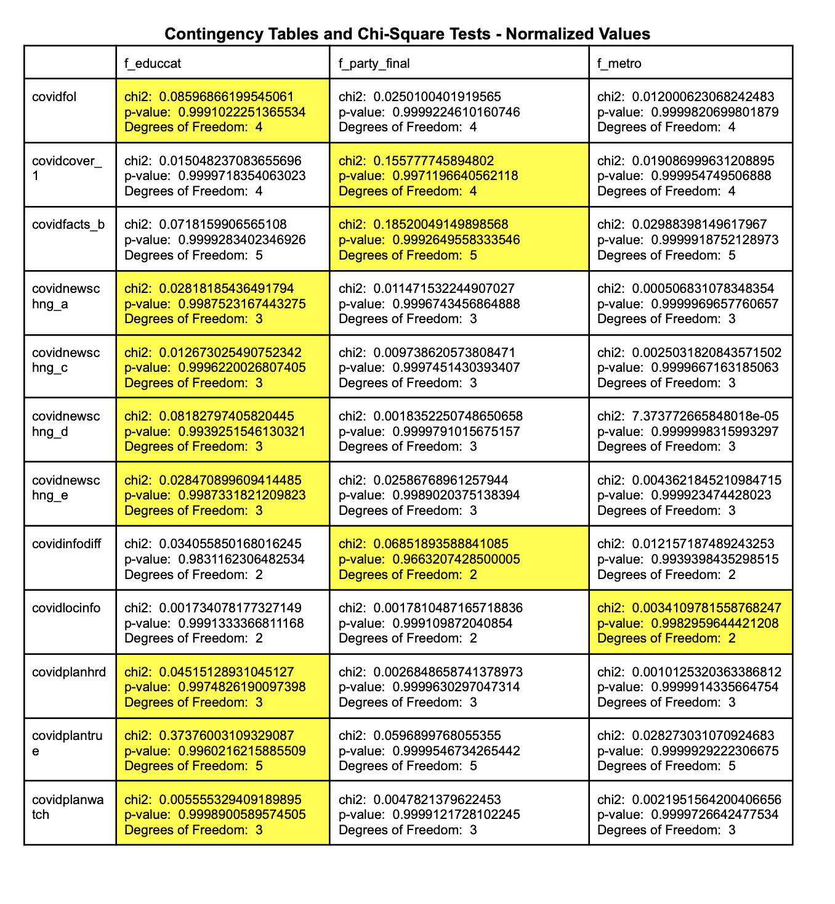  
 
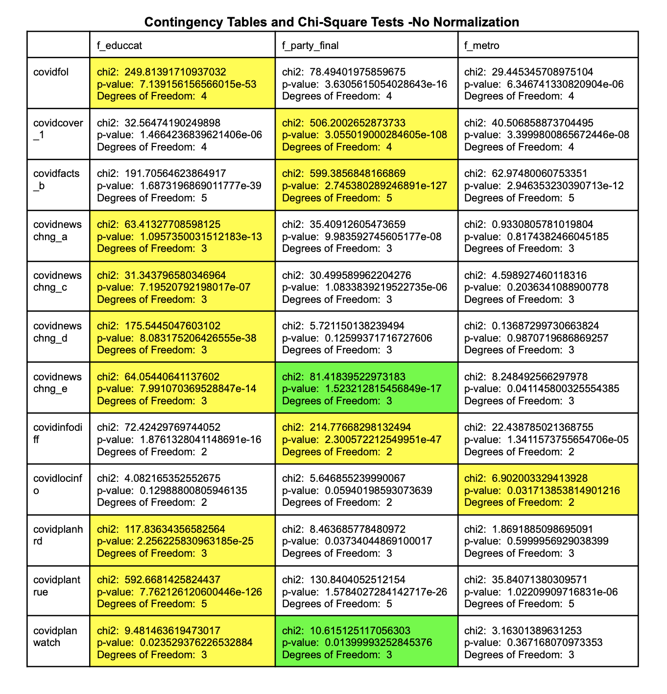 

 
I think this is a good sign that media literacy is something we can work to address in actionable ways. If we, as a society, invest in education and value education, we can improve the ability of people to navigate an increasingly complex information ecosystem. 

## Future Considerations
 
From a technical perspective: 

I know that there is a sizable industry focused solely on administering and interpreting surveys. I want to learn more about the purpose-built tools used in that industry and the methodologies they employ in seeking quantifiable meaning in datasets. 

There are incredibly useful data visualization tools on the market that can enhance the readability of the charts I created, making the message more clear. One of those, which I tested out, is called "Flourish" and I was curious to try it out because I saw some interesting visualizations on the web that had been created using this tool. I was looking, specifically, for a tool that could approximate the approach of many visualizations that PEW Research creates using their own datasets, where a horizontal stacked bar chart has a midpoint signifying a shift from positive to negative values. An example of such a chart can be found here. [Pew-Graph](https://www.pewresearch.org/politics/?attachment_id=20077157) When I used normalized values from contingency tables as the input for a graph on Flourish, I was able to create a rough, albeit imperfect approximation of the way that data is displayed in the PEW chart I linked. I want to know more about chart building tools in Python to see if similar graphing capabilities exist using Python. 

From the perspective of subject-area interest:
I want to know more about practical ways to make news media more useful to people in politically charged times and also, to investigate teachable strategies for news and online media consumers to improve meta-cognition in determining the trustworthiness of an information source. More of this instruction should happen at the K-12 level. 

## Code
My scripts were written to automate the tedious job of creating visualizations and calculations for each demographic matched up against each question. I have two graph-making classes, which function very similarly to one another, and a chi-square test which appends the results to a text file. 

## A collection of useful references
*   “An Introduction to the Chi-Square Test & When to Use It | SurveyGizmo.” 2018. Alchemer. https://www.surveygizmo.com/resources/blog/introduction-to-chi-square-test-and-when-to-use-it/ (February 23, 2021). 
  
    
*  “Catplot Python Seaborn: One Function to Rule All Plots With Categorical Variables.” 2019. Python and R Tips. https://cmdlinetips.com/2019/03/catplot-in-seaborn-python/ (February 23, 2021).  

*  Chambliss, Charlene. 2019. “Cleaning, Analyzing, and Visualizing Survey Data in Python.” Medium. https://towardsdatascience.com/cleaning-analyzing-and-visualizing-survey-data-in-python-42747a13c713 (February 23, 2021).  
    
*   Custer, Charlie. 2019. “How to Analyze Survey Data with Python for Beginners.” Dataquest. https://www.dataquest.io/blog/how-to-analyze-survey-data-python-beginner/ (February 22, 2021).  

*   NW, 1615 L. St, Suite 800Washington, and DC 20036USA202-419-4300 | Main202-857-8562 | Fax202-419-4372 | Media Inquiries. “American News Pathways.” Pew Research Center. https://www.pewresearch.org/topics/american-news-pathways/ (February 22, 2021).  
    
*  “Ordinal Association.” Statistics Solutions. https://www.statisticssolutions.com/ordinal-association/ (February 22, 2021).  

*   “Plotting with Categorical Data — Seaborn 0.11.1 Documentation.” http://seaborn.pydata.org/tutorial/categorical.html?highlight=bar%20plot (February 23, 2021).  
    
 *   “Scipy.Stats.Chisquare — SciPy v1.6.1 Reference Guide.” https://docs.scipy.org/doc/scipy/reference/generated/scipy.stats.chisquare.html (February 23, 2021).  

 *  “(Tutorial) Handling Categorical Data in Python.” 2020. DataCamp Community. https://www.datacamp.com/community/tutorials/categorical-data (February 22, 2021). 
 
    
*  “Understanding Chi Square | Practical Surveys.” https://practicalsurveys.com/reporting/chisquare.php (February 23, 2021). 

    
    ## Image Credit
    Source for the background image in my "cover image": Photo by <a href="https://unsplash.com/@thenewmalcolm?utm_source=unsplash&amp;utm_medium=referral&amp;utm_content=creditCopyText">Obi Onyeador</a> on <a href="https://unsplash.com/s/photos/news?utm_source=unsplash&amp;utm_medium=referral&amp;utm_content=creditCopyText">Unsplash</a>

